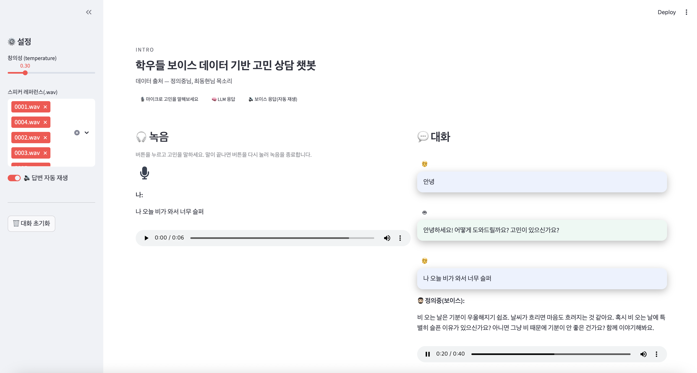

# 🎙️ 학우들 보이스 기반 고민 상담 챗봇

음성 입력 → ASR(텍스트 전사) → LLM 응답 → TTS(보이스 합성)까지 한 번에 처리하는 Streamlit 앱입니다.  
학우들 레퍼런스 음성을 넣으면 XTTS v2가 화자 톤·억양을 유사하게 합성합니다.

---

## ✨ 핵심 기능

- 마이크로 고민 말하기 → OpenAI Whisper 전사
- LLM 답변 생성(OpenAI Chat, `gpt-4o-mini`)
- 한국어 TTS(Coqui `XTTS v2`)로 보이스 합성
- 자동 재생(브라우저 정책 우회 스크립트 적용)
- 화자 레퍼런스(`dataset/wavs/*.wav`) 다중 선택
- temperature 조절, 대화 초기화, 커스텀 UI

---

## 🧱 아키텍처
[브라우저 Mic]  
↓     audio_recorder_streamlit (WAV)  
[Streamlit]  
↓     OpenAI Whisper (ko)  
[텍스트]  
↓     OpenAI Chat (gpt-4o-mini)  
[답변 텍스트]  
↓     Coqui TTS XTTS v2 (speaker_wav refs)  
[WAV 파일]  
↓      자동 재생(JS 보조)  
[사용자]  

---

## 📺 구현 화면

  

---

## 🔍 출처
https://github.com/coqui-ai/TTS?tab=readme-ov-file
